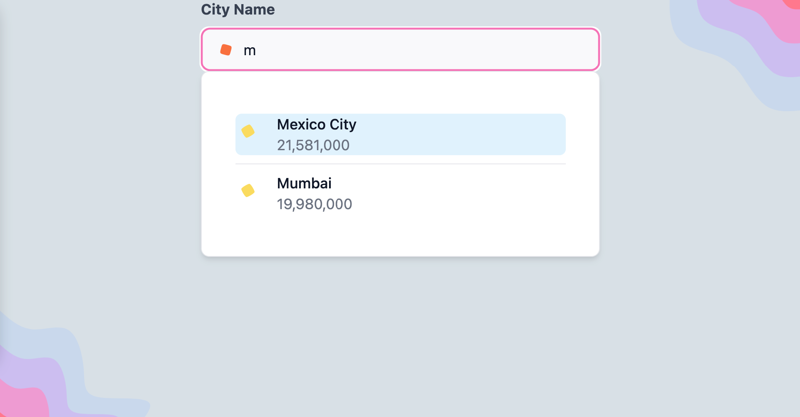

# Autocomplete input field build with Tailwind CSS and NextJS

Autocomplete input field styled with Tailwind CSS. This is very basic component
build for fun.

## Preview



## How to use it?

```bash
yarn
#and
yarn run dev
```

Open url: <http://localhost:3000/autocomplete>

